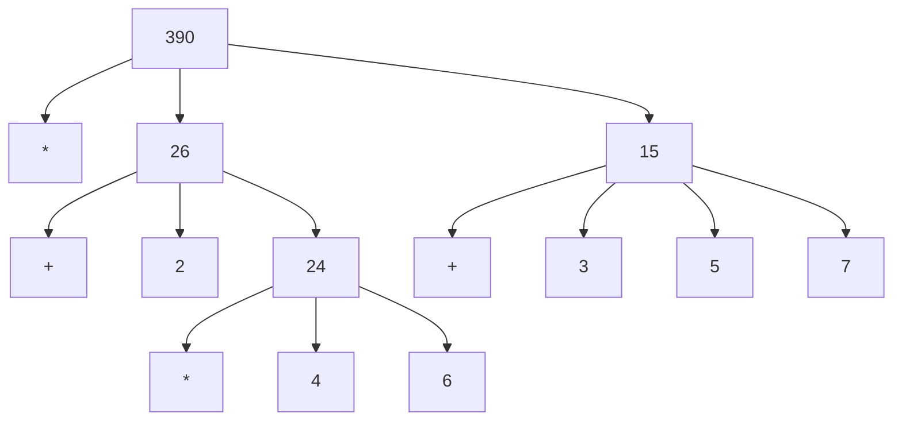

# 1.1.3. Вычисление комбинаций

Чтобы провести процесс вычисления для комбинации, нужно сначала проделать процесс вычисления для каждого элемента комбинации. Таким образом правило вычисления *рекурсивно* (**recursive**) по своей природе; это означает, что в качестве одного из своих шагов оно включает применение того же самого правила.

```scheme
(* (+ 2 (* 4 6))
   (+ 3 5 7))
```

Чтобы вычислить комбинацию (пример выше) с вложением (комбинаций), нужно применить правило вычисления к четырём вложенным комбинациям:

Рассматривая вычисление как дерево, мы можем представить, что значения операндов распространяются от концевых вершин вверх и затем комбинируются на всё более высоких уровнях. Форма правила вычисления “распространить значение наверх” является примером общего типа процессов, известного как *накопление по дереву* (**tree accumulation**).



1. Найти самую глубоко вложенную комбинацию - `(* 4 6)`
2. Выполнить комбинацию, применив оператор `*` к операндам `4` и `6` , тем самым заменив комбинацию `(* 4 6)` на элементарное выражение, числовую константу `24`

```scheme
(* (+ 2 24)
   (+ 3 5 7))
```

1. Выполнить две комбинации `(+ 2 24)` и `(+ 3 5 7)` на следующем уровне вложения, тем самым получив два элементарных выражение, числовые константы `26` и `15`
2. Выполнить последнюю комбинацию на самом верхнем уровне

```scheme
(* 26 15) ; 390
```
